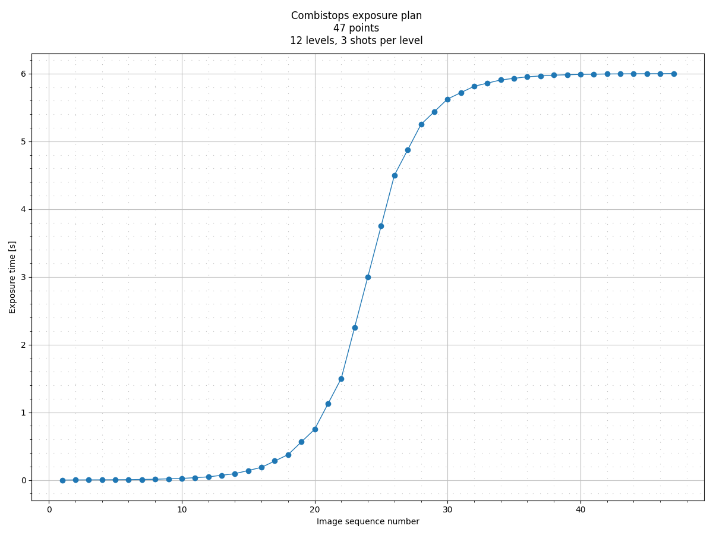
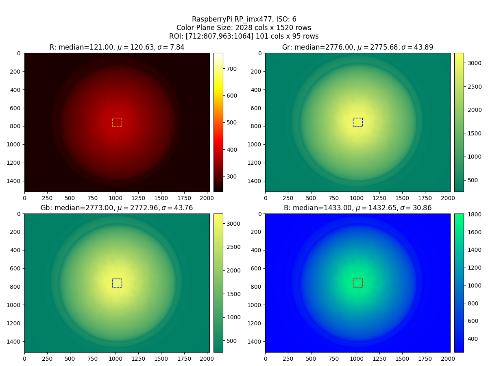
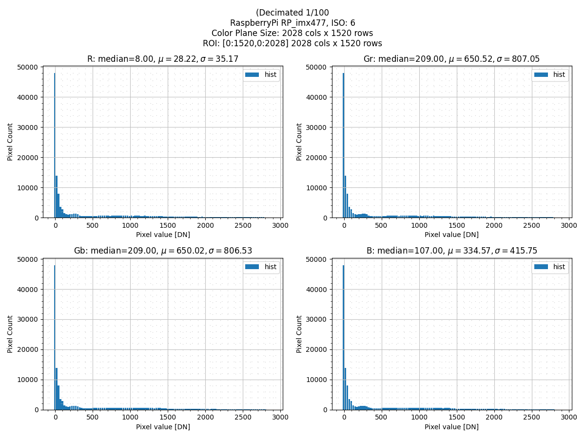
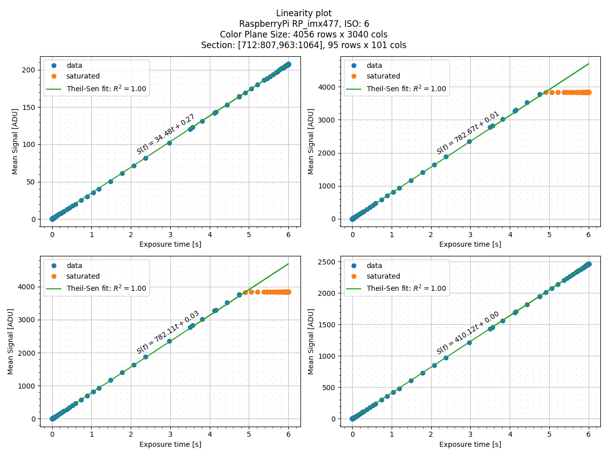
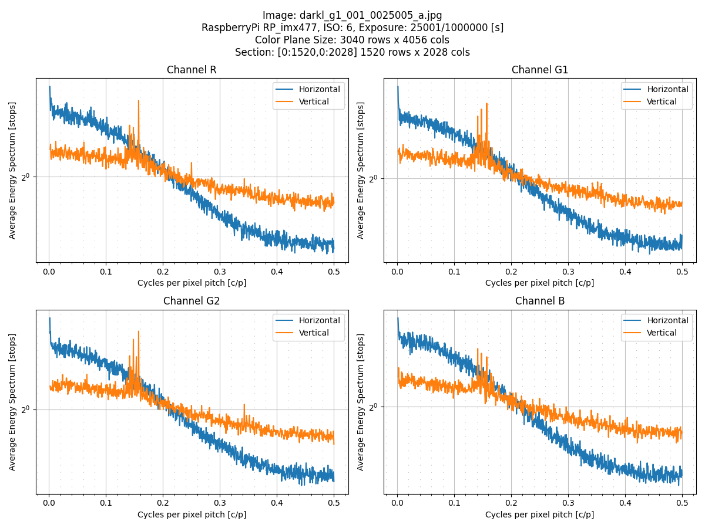
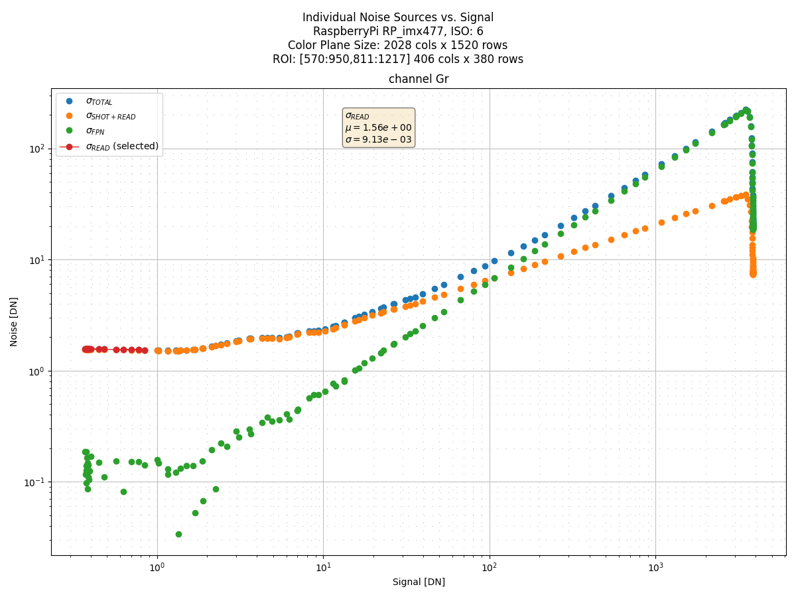
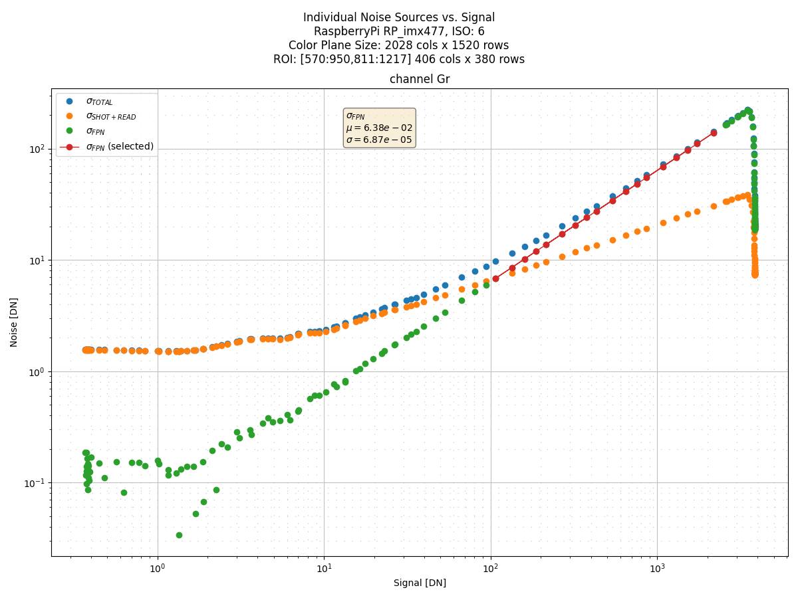
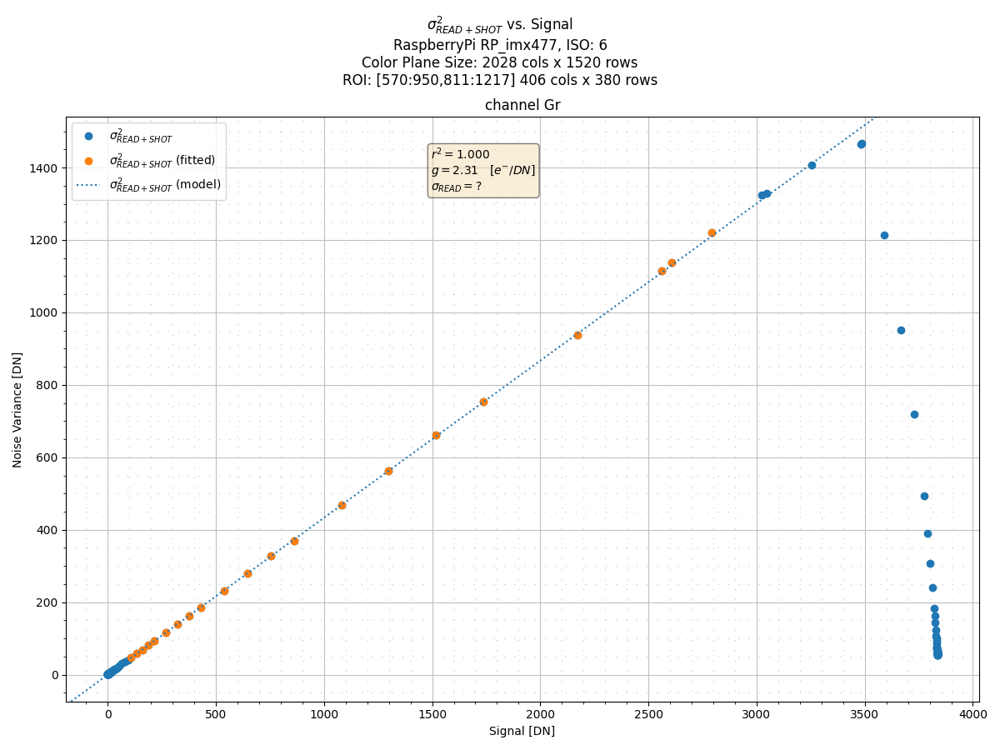
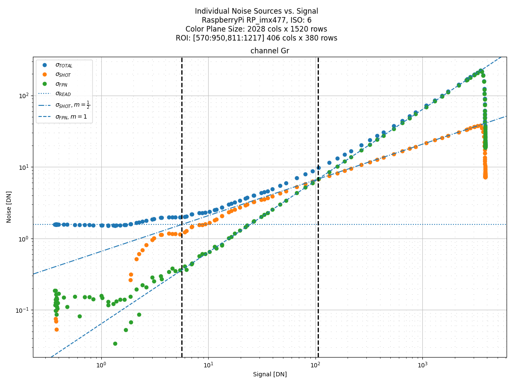
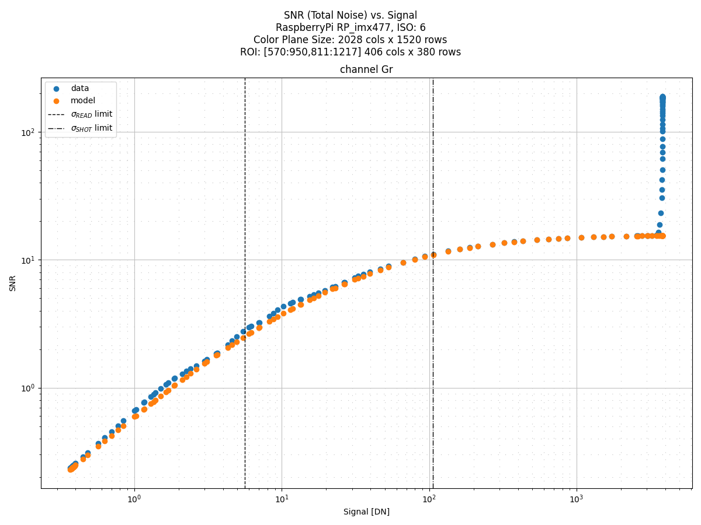

# rawplot
 
 Collection of plotting commands to analyze DSLR raw images using matplotlib.

 ## Installation
1. Clone project from GitHub repository
2. Create a virtual environment and activate it

```bash
(main) ~/repos/own/stars4all/rawplot$ python3 -m venv .venv
(main) ~/repos/own/stars4all/rawplot$ source .venv/bin/activate
```
3. Install it.

```bash
(.venv)  (main) ~/repos/own/stars4all/rawplot$ pip install -U pip
(.venv)  (main) ~/repos/own/stars4all/rawplot$ pip install .
```
# Usage

The available commands list can be found in the `bin` virtual environment sub-folder.

 ```bash
 ls .venv/bin/raw-*
 ```

## Common options

All utilities share these command line options, mainly used for debugging purposes:

* `⁻h, --help` shows program's options and exit
* `--version` show program's version numbe and exit.
* `--console` log debugging messages to console. Default level is `INFO`.
* `--log-file` log debugging messages to file.  Default level is `INFO`.
* `--verbose`  raises debugging level to `DEBUG`.
* `--quiet` lowers debugging level to `WARN`.

## Other common options using in many commands

### subsampling

* `--every` <N> Picks or subsamples an object retaled with the command (pick every N images in a file list, subsamples points in a histogram by /N, etc.)

### Color planes selection

Since we are dealing with RAW images, we are dealing with 4 separate color planes (channels): `R Gr Gb B`. Most of the commands supports being run on all or a subset of these color planes.

* `--channel` Specify which of the R, Gr, Gb, or B channels to handle by the command. Can be one or a combination of them. Some commands accept a G channel
(an average of Gr and Gb)

Order in the command line is not important. They are internally reordered so that the display & processing order is (R, Gr, Gb, B)

Valid Examples:
```bash
--channel B
--channel Gr Gb   
--channel R G B
--channel Gr R B Gb
```
Invalid Examples:

```bash
--channel B B (duplicated)
--channel R A (A is not supported)
--channel R G B Gb (this commbination is not supported)
```
### Region of Interest (ROI)

A ROI is specified given its starting point `(x0, y0)` and dimensions `(width, height)`. To unifomingly address the different resolutions in camera formats, a normalized ROI is used as input, where both the starting point and dimensions are normalized between 0 and 1. In addition `x0+width <= 1.0` and `y0+height <= 1.0`. When the `(x0,y0)` starting point is not specified in the command line, the `(width,height)` dimensions are assumed with respect to the image center.

The different ROI parameters on the command line can be specified as either as decimals or fractions for convenience.

Example:
```
--x0 0.2 --y0 0.1 --width 1/3 --height 1/4 
```

Only when an image file is open, this normalized ROI transforms into a physical ROI with pixels. When the physcal ROI is displayed in several graphs, it is done using [NumPy](https://numpy.org/) matrix style `[y0:y1,x0:x1]`.

# Commands

Bref description of commands and results. The examples has been taken with the [Raspberry Pi HQ Camera](https://www.raspberrypi.com/products/raspberry-pi-high-quality-camera/), intalled in a [GoNET project](https://www.researchgate.net/publication/351459667_The_GONet_Ground_Observing_Network_Camera_An_Inexpensive_Light_Pollution_Monitoring_System) device.

## rawplot-master

Utility to make master bias, dark or flat frames from a series of RAW files.


```bash
rawplot-master --console --input-dir images/20240124/biases/ --filter bias* --batch 5 --prefix master --imag$e^-$type bias
```

Produces the following result:


```bash
2024-02-03 12:38:17,855 [INFO] ============== rawplot.master 0.1.dev89+gc34abee ==============
2024-02-03 12:38:17,855 [INFO] Normalized ROI is [P0=(0.0000,0.0000) DIM=(1.0000 x 1.0000)]
2024-02-03 12:38:17,921 [INFO] The process comprises 8 batches of 5 images max. per batch
2024-02-03 12:38:17,921 [INFO] [1/8] Begin loading 5 images into RAM with R Gr Gb B channels, 2028 x 1520 each
2024-02-03 12:38:18,343 [INFO] [2/8] Begin loading 5 images into RAM with R Gr Gb B channels, 2028 x 1520 each
2024-02-03 12:38:18,727 [INFO] [3/8] Begin loading 5 images into RAM with R Gr Gb B channels, 2028 x 1520 each
2024-02-03 12:38:19,124 [INFO] [4/8] Begin loading 5 images into RAM with R Gr Gb B channels, 2028 x 1520 each
2024-02-03 12:38:19,513 [INFO] [5/8] Begin loading 5 images into RAM with R Gr Gb B channels, 2028 x 1520 each
2024-02-03 12:38:19,892 [INFO] [6/8] Begin loading 5 images into RAM with R Gr Gb B channels, 2028 x 1520 each
2024-02-03 12:38:20,274 [INFO] [7/8] Begin loading 5 images into RAM with R Gr Gb B channels, 2028 x 1520 each
2024-02-03 12:38:20,658 [INFO] [8/8] Begin loading 1 images into RAM with R Gr Gb B channels, 2028 x 1520 each
2024-02-03 12:38:20,794 [INFO] Saving master bias file from 36 images in /home/rafa/repos/own/lica/rawplot/master_bias_frame_aver.fit
```


## rawplot-plan

Before analyzing camera images, the first thing to do is to take images. This utility helps to design an exposue plan, with a number of images of number of images and exposure time for each one. There are several strategies. For linearity study purposes, it may be worth to concentrate capture on both ends of the exposure range, so that we may have a more detailed view of non linearities.

For instance, the `combistops` is based on the maximun DN produced by the camera (4095 for the Raspberry Pi HQ Camera). It performs up to $log_{2}(DN_{MAX})$ iterations with an specified points per iteration (defaults to 3).

```bash
rawplot-plan combistops -ti 1/1000 -tf 6 -m 4095
```


## rawplot-image

This utility displays a single image or histogram. useful to determine exposure levels and region of interest.

```bash
rawplot-image --console pixels -i images/20240117/linearity/flath_g1_001_3500000_a.jpg -wi 1/20 -he 1/16
```

As the image shows, this exposure is shows severe vignetting.
For the linearity plot below, we chose a small ROI in the image center to quickly detect saturation. 
Otherwise, vignetting bias the statistics.

When using a larger ROI, this vignetting is shown as the Fixed Pattern Noise component 
of the noise analysis as shown by the PTC graph below.



```bash
rawplot-image --console histo -i images/20240117/linearity/flath_g1_001_3500000_a.jpg --every 100
```



## rawplot-linearity

Plots a linearity graph from a set of flat-field images. Also, tries to detect the sensor saturation point and fit a linear graph.

```bash
rawplot-linearity --console -i images/20240117/linearity/ -f flat* -wi 1/20 -he 1/16 --every 2
```

The example shows a linearity plot measured in a small subset of the image center. Since our flat field captures were taken in A, B pairs, we pick every two images on the *sorted* image list. Our directory also contains dark images so we specify a `flat*` glob filter.

This plot was taken up to its entire range of exposure range (6 seconds)



## HV Spectrogram plot

This plot is included here based on the excelent blog post [THE HV SPECTROGRAM](https://www.strollswithmydog.com/hv-spectrogram/) by Jack (aka AlmaPhoto)
See the aforementioned post for more details.

In the tests I made, the HV plots showed a strong peak at (0) that flattens the rest of the graph, even after removing the mean signal from the image itself. Hence, I have included the`--start` option. The results are in line with [Jack's analysis of the RaspberryPi HQ camera performance](https://www.strollswithmydog.com/pi-hq-cam-sensor-performance/).

```bash
rawplot-hv --console -i images/20240117/linearity/darkl_g1_001_0025005_a.jpg --start 3
```


## Photon Transfer Curves (PTC)

An (ongoing) series of PTC charts, based on the classic [Photon Transfer](https://www.spiedigitallibrary.org/ebooks/PM/Photon-Transfer/eISBN-9780819478382/10.1117/3.725073#_=_) book have been included so far:

|  CURVE   |                Description               | Units                       |
| :------: | :--------------------------------------- | :-------------------------- |
| Curve 1  | read, shot, FPN & total noise vs. signal | log rms DN vs. log DN       |
| Curve 1  | read, shot, FPN & total noise vs. signal | log rms $e^-$ vs. log $e^-$ |
| Curve 2  | read + shot noise vs. signal             | log rms DN vs. log DN       |
| Curve 2  | read + shot noise vs. signal             | log rms $e^-$ vs. log $e^-$ |
| Curve 3  | shot noise vs. signal                    | log rms DN vs. log DN       |
| Curve 3  | shot noise vs. signal                    | log rms $e^-$ vs. log $e^-$ |
| Curve 4  | FPN vs. signal                           | log rms DN vs. log DN       |
| Curve 4  | FPN vs. signal                           | log rms $e^-$ vs. log $e^-$ |
| Curve 5  | Read + Shot Noise Variance vs. signal    | DN vs. DN                   |
| Curve 6  | SNR vs. signal                           | log SNR vs. log DN          |
| Curve 6  | SNR vs. signal                           | log SNR vs. log $e^-$       |           


### PTC Noise and Variance Curves

From the same dataset we used to determine the camera linearity, we generate PTC Curve #1, this time with a bigger ROI.
For this technique to work, we require to have images taken *in pairs* at the same exposure time (i.e `(flatm_g1_047_0001450_a.jpg, 'flatm_g1_047_0001450_b.jpg')`.


```bash
rawplot-ptc --console curve1 -i images/20240117/linearity/ -f flat* -wi 1/5 -he 1/4 --channels Gr
```


With the ROI as large as this one, vignetting shows up and we can see the three main components of noise in this PTC analysis.

The gain, readout noise and fixed patter noise factor factor can be estimated by visual inspection, choosing a point in the appropiate sector from this plot curve and applying the corresponding formula. This visual inpection process can be aided 
aided by choosing several points in a selected signal range, applying the formula for each one and taking the average:

```bash
rawplot-ptc --console curve1 -i images/20240117/linearity/ -f flat* -wi 1/5 -he 1/4 --channels Gr --read-noise estimate --from 0.1 --to 5
```



```bash
rawplot-ptc --console curve1 -i images/20240117/linearity/ -f flat* -wi 1/5 -he 1/4 --channels Gr --p-fpn estimate --from 100 --to 2500
```



```bash
rawplot-ptc --console curve5 -i images/20240117/linearity/ -f flat* -wi 1/5 -he 1/4 --channels Gr --fit --from 100 --to 2800
```

The gain can be more accurately estimated by fitting a straigth line into the Readout + Shot Noise Variance vs Signal curve.





Finally, we can depict the three noise regions in this PTC, either in [DN] or [$e^-$] units.

```bash
rawplot-ptc --console curve1 -i images/20240117/linearity/ -f flat* -wi 1/5 -he 1/4 --channels Gr --read-noise 1.56 --p-fpn 6.38$e^-$2 --gain 2.31
```




### PTC Signal to Noise Curve

Another way to display the camera performance is to directly display the Signal to Noise Ratio vs signal. If the `gain` ($g$) `read-noise` ($\sigma_{READ}$) and `p-fpn ` ($p_{FPN}$) parameters are given, a plot according model is also displayed, so that we can compare the actual SNR versus the expected SNR based on the model equation:

```math
SNR = \frac{S}{\sqrt{\sigma_{READ}^2 + (S/g) + (p_{FPN}S)^2}}
```
Where $S$, $\sigma_{READ}$ and $p_{FPN}$ are given in DN and $g$ in $e^{-}/DN$

```bash
rawplot-ptc --console curve6 -i images/20240117/linearity/ -f flat* -wi 1/5 -he 1/4 --channels Gr --read-noise 1.56 --p-fpn 6.38$e^-$2 --gain 2.31
```



Given the current values of $\sigma_{READ}$, $\sigma_{SHOT}$ and $\sigma_{FPN}$ in the model equation, the vertical lines in the plot above shows where the $\sigma_{SHOT}$ noise begins to dominate over the $\sigma_{READ}$ noise and where the $\sigma_{FPN}$ noise begins to dominate over the $\sigma_{SHOT}$ noise.
