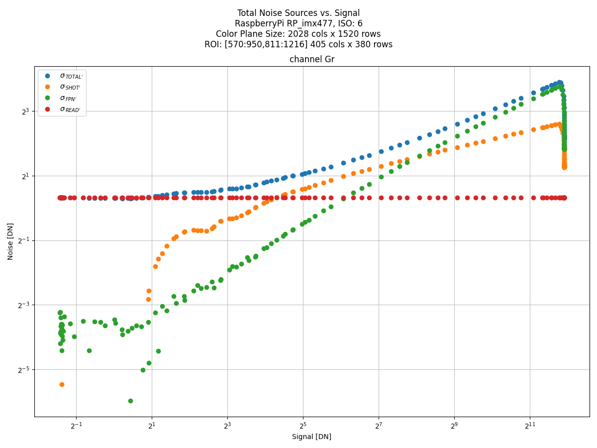
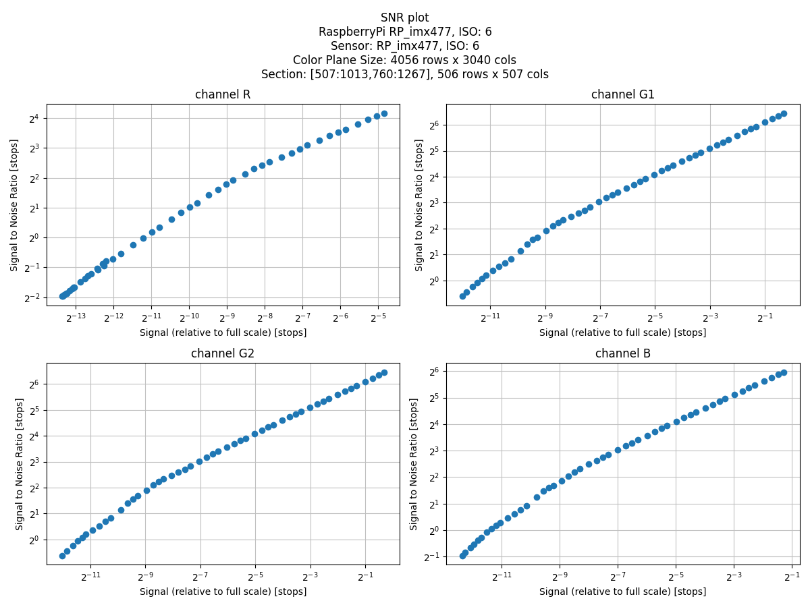

# rawplot
 
 Collection of plotting commands to analyze DSLR raw images using matplotlib.

 ## Installation
1. Clone project from GitHub repository
2. Create a virtual environment and activate it

```bash
(main) ~/repos/own/stars4all/raw-plot$ python3 -m venv .venv
(main) ~/repos/own/stars4all/raw-plot$ source .venv/bin/activate
```
3. Install it.

```bash
(.venv)  (main) ~/repos/own/stars4all/raw-plot$ pip install -U pip
(.venv)  (main) ~/repos/own/stars4all/raw-plot$ pip install .
```
# Usage

The available commands list can be found in the `bin` virtual environment sub-folder.

 ```bash
 ls .venv/bin/raw-*
 ```

## Common options

All utilities share these command line options, mainly used for debugging purposes:

* `⁻h, --help` shows program's options and exit
* `--version` show program's version numbe and exit.
* `--console` log debugging messages to console. Default level is `INFO`.
* `--log-file` log debugging messages to file.  Default level is `INFO`.
* `--verbose`  raises debugging level to `DEBUG`.
* `--quiet` lowers debugging level to `WARN`.

## Other common options using in many commands

### subsampling

* `--every` <N> Picks or subsamples an object retaled with the command (pick every N images in a file list, subsamples points in a histogram by /N, etc.)

### Color planes selection

Since we are dealing with RAW images, we are dealing with 4 separate color planes (channels): `R G1 G2 B`. Most of the commands supports being run on all or a subset of these color planes.

* `--channel` Specify which of the R, G1, G2, or B channels to handle by the command. Can be one or a combination of them. Some commands accept a G channel
(an average of G1 and G2)

Order in the command line is not important. They are internally reordered so that the display & processing order is (R, G1, G2, B)

Valid Examples:
```bash
--channel B
--channel G1 G2   
--channel R G B
--channel G1 R B G2
```
Invalid Examples:

```bash
--channel B B (duplicated)
--channel R A (A is not supported)
--channel R G B G2 (this commbination is not supported)
```
### Region of Interest (ROI)

A ROI is specified given its starting point `(x0, y0)` and dimensions `(width, height)`. To unifomingly address the different resolutions in camera formats, a normalized ROI is used as input, where both the starting point and dimensions are normalized between 0 and 1. In addition `x0+width <= 1.0` and `y0+height <= 1.0`. When the `(x0,y0)` starting point is not specified in the command line, the `(width,height)` dimensions are assumed with respect to the image center.

The different ROI parameters on the command line can be specified as either as decimals or fractions for convenience.

Example:
```
--x0 0.2 --y0 0.1 --width 1/3 --height 1/4 
```

Only when an image file is open, this normalized ROI transforms into a physical ROI with pixels. When the physcal ROI is displayed in several graphs, it is done using [NumPy](https://numpy.org/) matrix style `[y0:y1,x0:x1]`.

# Commands

Bref description of commands and results. The examples has been taken with the [Raspberry Pi HQ Camera](https://www.raspberrypi.com/products/raspberry-pi-high-quality-camera/), intalled in a [GoNET project](https://www.researchgate.net/publication/351459667_The_GONet_Ground_Observing_Network_Camera_An_Inexpensive_Light_Pollution_Monitoring_System) device.

## rawplot-plan

Before analyzing camera images, the first thing to do is to take images. This utility helps to design an exposue plan, with a number of images of number of images and exposure time for each one. There are several strategies. For linearity study purposes, it may be worth to concentrate capture on both ends of the exposure range, so that we may have a more detailed view of non linearities.

For instance, the `combistops` is based on the maximun DN produced by the camera (4095 for the Raspberry Pi HQ Camera). It performs up to `log2(MAX DN)`  iterations with an specified points per iteration (defaults to 3).

```bash
rawplot-plan combistops -ti 1/1000 -tf 6 -m 4095
```


## rawplot-image

This utility displays a single image or histogram. useful to determine exposure levels and region of interest.

```bash
rawplot-image --console pixels -i images/20240117/linearity/flath_g1_001_3500000_a.jpg -wi 1/20 -he 1/16
```


```bash
rawplot-image --console histo -i images/20240117/linearity/flath_g1_001_3500000_a.jpg --every 100
```


## rawplot-linearity

Plots a linearity graph from a set of flat-field images. Also, tries to detect the sensor saturation point and fit a linear graph.

```bash
rawplot-linearity --console -i images/20240117/linearity/ -f flat* -wi 1/20 -he 1/16 --every 2
```

The example shows a linearity plot measured in a small subset of the image center. Since our flat field captures were taken in A, B pairs, we pick every two images on the *sorted* image list. Our directory also contains dark images so we specify a `flat*` glob filter.

This plot was taken up to its entire range of exposure range (6 seconds)


## HV Spectrogram plot

This plot is included here based on the excelent blog post [THE HV SPECTROGRAM](https://www.strollswithmydog.com/hv-spectrogram/) by Jack (aka AlmaPhoto)
See the aforementioned post for more details.

In the tests I made, the HV plots showed a strong peak at (0) that flattens the rest of the graph, even after removing the mean signal from the image itself. Hence, I have included the`--start` option. The results are in line with [Jack's analysis of the RaspberryPi HQ camera performance](https://www.strollswithmydog.com/pi-hq-cam-sensor-performance/).

```bash
rawplot-hv --console -i images/20240117/linearity/darkl_g1_001_0025005_a.jpg --start 3
```


## Photon Transfer Charts (PTC)

An (ongoing) series of PTC charts, based on the classic (Photon Transfer)[https://www.spiedigitallibrary.org/ebooks/PM/Photon-Transfer/eISBN-9780819478382/10.1117/3.725073#_=_] book have been included so far:

|  CHART   |                Description               | Units                   |
| :------: | :--------------------------------------- | :---------------------- |
| Chart 1  | read, shot, FPN & total noise vs. signal | log2 rms DN vs. log2 DN |
| Chart 2  | read + shot noise vs. signal             | log2 rms DN vs. log2 DN |
| Chart 3  | shot noise vs. signal                    | log2 rms DN vs. log2 DN |
| Chart 4  | FPN vs. signal                           | log2 rms DN vs. log2 DN |


From the same dataset we used to determine the camera linearity, we generate PTC Chart #1, this time with a bigger ROI.
For this technique to work, we require to have images taken in pairs at the same exposure time (i.e `(flatm_g1_047_0001450_a.jpg, 'flatm_g1_047_0001450_b.jpg')`.


```bash
rawplot-ptc --console chart1 -i images/20240117/linearity/ -f flat* -wi 1/5 -he 1/4 --channels Gr
```

If not specified in the command line, the read noise line is at 0 DN (not shown) so that we estimate its value from the total noise plot.

After plot analysis, it can be experimentally determined that the read noise is about 1.25 DN
At Signal level 19 DN approx. the shot noise equals the readout noise. At signal level 268 DN approx. the
shot noise equals the Fixed Pattern Noise (FPN) (3 DN approx.)

```bash
rawplot-ptc --console chart1 --read-noise 1.25 -i images/20240117/linearity/ -f flat* -wi 1/5 -he 1/4 --channels Gr 
```




## Signal to Noise Ratio plot

(likely to be removed if expanding the PTC commands)

This plot is also based on the blog posts [Determining Sensor IQ Metrics: RN, FWC, PRNU, DR, gain – 1](https://www.strollswithmydog.com/determining-sensor-iq-metrics-rn-fwc-prnu-gain/) and [Determining Sensor IQ Metrics: RN, FWC, PRNU, DR, gain – 2](https://www.strollswithmydog.com/determining-sensor-iq-metrics-rn-fwc-prnu-dr-gain-2/)

```bash
rawplot-snr -d images/20240117/linearity -f flatm* -wi 1/4 -he 1/3 --stops --full-scale 4095
```


Parameter estimation: 
Readount Noise (RN) [e-], Full Well Capacity (FWC) [e-], Pixel Response Non Uniformity (PRNU) p (%), Gain (g) [DN/e-] Still and ongoing work ...

***Pending ...***
